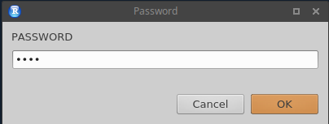
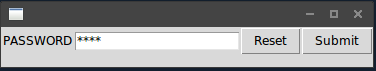
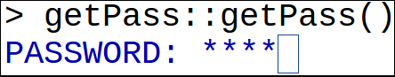

# Introduction

**getPass** is an R package for reading user input in R with masking.  The package can be installed with the usual `install.packages()`.  There is one exported function, `getPass()`, which will behave as R's `readline()` but with masked input.  You can pass a message to the password input via the `msg` argument, similar to the `prompt` argument in `readline()`.

The form that password input takes will vary based on how you interface to R (with implementation details below).  If you use **RStudio**, it will look something like this:



If you use **RGui** on Windows or **R.app** (if **tcltk** is supported; see section below), it will look like:



Finally, if you use the terminal (any OS), it will look like:



We believe this covers pretty much everyone.  One notable exclusion is emacs.  Due to how it handles buffers, I believe it *can't* be supported.  If that is incorrect, please let us know!


# Password Reading

Currently there are two arguments to `getPass()`.  By setting the `msg` parameter, you can change what is printed in the password dialogue box:

```r
getPass()
## PASSWORD: ****
## [1] "asdf"

getPass(msg="")
## ****[1] "asdf"

getPass(msg="shh, it's a secret! ")
## shh, it's a secret! ****
## [1] "asdf"
```

Finally, there is the `forcemask` flag, which indicates if reading without masking should be possible.  By default, if one is running under an environment that does not allow reading with masking, then a warning message will be printed, and R's ordinary `readline()` will be used.  However, if this flag is set to `TRUE`, then the function will stop with an error.


## Implementation Details

### RStudio
To use this with RStudio, you need:

* RStudio desktop version >= 0.99.879.
* The rstudioapi package version >= 0.5.

In this case, the `getPass()` function wraps the **rstudioapi** function `askForPassword()`.

### Command Line
Here, the input reader is custom C code.  It has been tested successfully on Windows (in the "RTerm" session), Mac (in the terminal, not R.app which will not work!), Linux, and FreeBSD.  The maximum length for a password in this case is 200 characters.

On Windows, the reader is just `_getch()`.  On 'nix environments (Mac, Linux, ...), masking is made possible via `tcsetattr()`.  Special handling for each is provided for handling `ctrl+c` and backspace.

If you discover a problem using this, please [file an issue report](https://github.com/wrathematics/getPass/issues).

### RGui (Windows)
If you use RGui (the Windows R GUI), then this should use the **tcltk** package.  I don't think it's actually possible for **tcltk** to be unavailable on Windows, so if you are an RGui user and have trouble with this, please [file an issue report](https://github.com/wrathematics/getPass/issues).

### R.app (Mac)
You will need to install dependencies for the **tcltk** package.  I'm not completely sure what this process involves for Macs; if you know, please let us know.  If **tcltk** is unavailable, then it will use the "unsupported" method below.

### Other/Unsupported Platforms
When a platform is unsupported, the function will optionally default to use R's `readline()` (without masking!) with a warning communicated to the user, or it can stop with an error.


# Password Hashing

Included with the package is an implementation of the argon2 secure password hashing function.  Many experts (of which I am not one) have written at length about this topic; and it can quickly get kind of complicated and mathy.  The basic idea is: don't store passwords as plaintext.  We can use a secure hash function to hash the password, basically turn the input string into a new "garbled" string.  Hash functions are hard to invert, so you can know which hash function I used and know the output, and still (hopefully) not recover the original string.

Using **getPass**, we can quickly handle this problem without having to think very hard.  Say you have your password:
```{r}
library(getPass)

pass <- "myPassw0rd!"
```
An excellent choice to be sure.  This is the "plaintext".  We can hash it with a call to `pw_hash()`:
```{r}
hash <- pw_hash(pass)
hash
```
Now say you need to validate a password that's been entered against the hashed password.  All you need to do is call `pw_check()`:
```{r}
pw_check(hash, pass)
pw_check(hash, "password")
pw_check(hash, "1234")
```

Note that the largest a password can be is 32 characters.


## Gritty Boring Details
This package distributes the argon2 hash.  By default, it will use the argon2i version, but the argon2d version is available via an argument to `pw_hash()`.  For additional secure hash functions, see the **sodium**, **bcrypt**, and **openssl** packages.

The binding in this package uses a 256 bit salt with data generated from Mersenne Twister (MT).  MT is not a cryptographically secure PRNG, but that's ok.  The salt (which can actually be public) just protects against rainbow tables.  The other algorithm parameters we use include a "time cost" (number of passes) of 16, "memory cost" of 8192 MiB, and 1 thread.


# Acknowledgements

We thank Kevin Ushey for his assistance in answering questions in regard to supporting RStudio.

The development for this package was supported in part by the project *Harnessing Scalable Libraries for Statistical Computing on Modern Architectures and Bringing Statistics to Large Scale Computing* funded by the National Science Foundation Division of Mathematical Sciences under Grant No. 1418195.

Any opinions, findings, and conclusions or recommendations expressed in this material are those of the authors and do not necessarily reflect the views of the National Science Foundation.


<script language="JavaScript" src="include/headers.js"></script>
